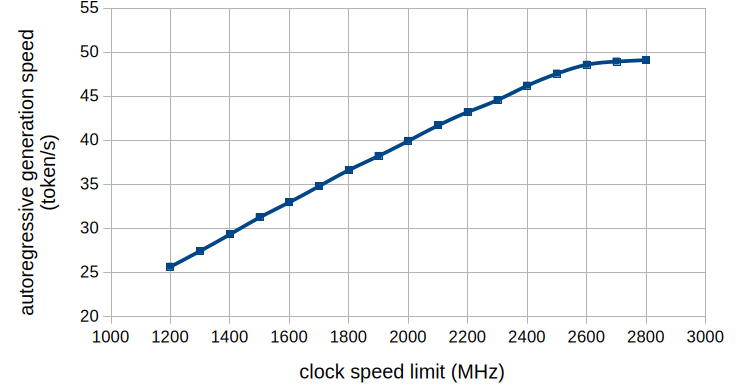

This repo archives the random experiments I've done that seem valuable to share with the public, but not complete enough to be a project of their own.
Below is the list of the experiments done, linked to the respective sub-folders for each of the experiment.

List of experiments done (chronologically ordered)
---

### [Finding the gpu power sweet spot](./finding_the_gpu_power_sweet_spot/README.md) (2026/05/21)

Inspired by this [reddit post](https://www.reddit.com/r/LocalLLaMA/comments/1tayu5t/stop_wasting_electricity/), I decided to do an experiment to find the ideal power limit. The result isn't all that surprising, I ended up deciding to limit the clock speed to 2600 MHz for my 5090 when serving models.

### [Finding the maximum `-ngl` required to run qwen3.6 27B on q8](./local_inference_on_5090/qwen3.6_27b_ngl_and_ts/README.md) (2026/07/30)

I wanted to find out the required cpu offload needed to run `Qwen3.6 27B` on q8 on single RTX 5090. Thanks to `llama-cli` and `llama-bench`, the experiment went smoothly. Some quick numbers to look at:

| Context Size (`-c`) | KV Cache (`--cache-k` & `--cache-v`) | Maximum `--ngl` |
| --- | --- | --- |
| 262144 | f16 | 44 |
| 262144 | q8_0 | 53 |
| 131072 | f16 | 57 |
| 131072 | q8_0 | 64 (no offload needed) |

| `--ngl` | pp2048 | tg128 @ 2048 |
| --- | --- | --- |
| 44 | 876.5 | 5.441 |
| 57 | 1716 | 12.22 |