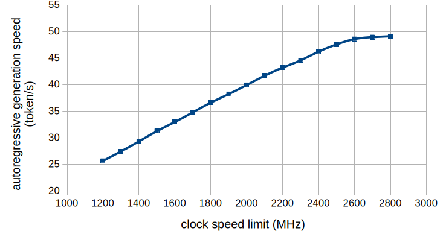
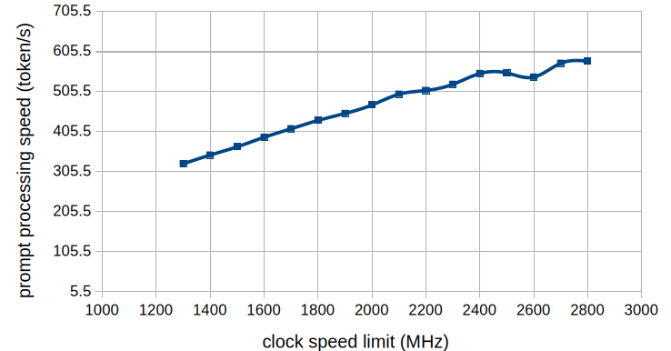
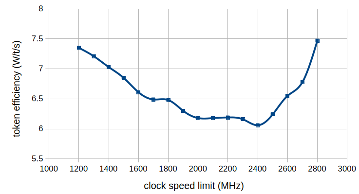

# Finding the gpu power sweet spot (2026/05/21)

Motivation
---

I stumbled upon this [reddit post](https://www.reddit.com/r/LocalLLaMA/comments/1tayu5t/stop_wasting_electricity/), and the idea that the token generation speed doesn't scale proportionally with the power, even though the GPU always tries to max out performance, made this experiment attractive enough to spend my time on.

Just a few days ago my GPU disconnected from my PC. Though not confirmed, I highly suspect it was caused by overheating. If the nonlinearity reported by the post is true, setting a power limit would make my local model serving setup much more robust.

Objective
---

After a bit of research (by the LLM), I decided to use GPU clock speed instead of direct power as the target to limit. The goal is therefore to **find the point where the model performance plateaus against a set clock speed limit**.

Model performance here is measured by prompt processing speed and autoregressive token generation speed.

Experiment Setup
---

*Environment:*
- OS: Ubuntu 24.04.4 LTS
- GPU: NVIDIA GeForce RTX 5090
- Inference backend: llama server run with the `ghcr.io/ggml-org/llama.cpp:server-cuda13` docker image
- Model: [Qwen3.6-27B-UD-Q6_K_XL.gguf](https://huggingface.co/unsloth/Qwen3.6-27B-GGUF) from unsloth (theoretically any resource-intensive model should work)

*Steps to reproduce:*
1. Set the GPU clock speed threshold with `sudo nvidia-smi -lgc <lower_bound>,<upper_bound>`
2. Start the server with model loaded
3. Start recording the power usage with `nvidia-smi --query-gpu=timestamp,power.draw,clocks.current.graphics --format=csv > "$CSV_PATH"`
4. Run the model with `n_predict` flag set (500 was used here).
5. Iterate until hitting the performance plateau. I started from 1200 MHz, went all the way to 2800 MHz to find the threshold

*Notes:*
1. If automatic warm up is disabled, make sure to do a warm up run before starting the record
2. The experiment itself can largely be automated. If you want to do this yourself, just show your coding agent this README and run the script it produces — except for the sudo command; you'd better execute that yourself.
3. `sudo nvidia-smi -lgc <lower_bound>,<upper_bound>` will not persist across system restarts. I chose to leave it that way, but there are methods to make it persistent.
4. The experiment prompt used: "Provide a comprehensive, highly detailed analysis of the socioeconomic factors leading to the industrial revolution in Europe. Ensure the response covers agricultural advancements, capital accumulation, and technological innovations."

Results
---

Experiment result is stored [here](./experiment_result.csv).
The result showed a clear sweet spot around 2400 ~ 2600 MHz. Anything higher is much more inefficient.
I ended up choosing 2600 MHz as the setting for future model serving.

